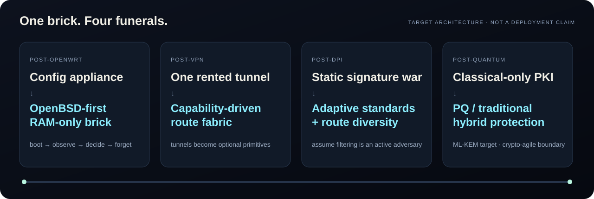
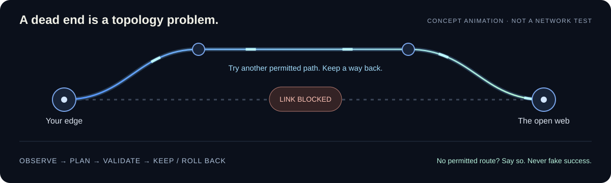

<div align="center">

# 👟 BLUESHOES

### **POST-OPENWRT · POST-VPN · POST-DPI · POST-QUANTUM**

# **THE INTERNET IS FREE. AGAIN!**

### **An AI-driven routing brick for cheap routers.**

**OpenBSD-first · RAM-only · self-healing · self-evolving · Rheknel-governed**

*The router that refuses to trust the network, the cloud, the model — or itself.*

[Why](#-the-proposition) · [Mutation](#-asynchronous-topological-mutation) · [mbsd](#-mbsd-the-empty-machine) · [Rheknel](#-rheknel-local-truth-or-it-didnt-happen) · [Post-quantum](#-post-quantum-by-architecture-not-by-sticker) · [Play](#-break-the-little-internet) · [Reality](#-we-dont-fake-receipts)

</div>

<p align="center">
  
</p>

> **This is the target architecture Blueshoes is building toward.** The README is intentionally ambitious. The [reality section](#-we-dont-fake-receipts) separates architecture from what this repository has actually proved.

---

## ⚡ The proposition

The old router stack accumulated too many sovereigns.

A firmware vendor owns the box. DNS owns the name. BGP owns the path. A VPN vendor rents you one exit. A cloud dashboard remembers the configuration. Classical-only public-key exchange assumes *harvest now, decrypt later* is someone else's problem. And an AI agent can always write a wonderfully confident sentence about a thing that never executed.

**Blueshoes is the refusal.**

It is being designed as a **post-OpenWrt, post-VPN, post-DPI, post-quantum network operating system** for inexpensive commodity routers: a small OpenBSD-first machine that lives in RAM, measures its local network, forms bounded hypotheses, proposes topology changes, submits them to a deterministic local authority, validates the result, heals backward when wrong, and forgets operational exhaust when power disappears.

No rented identity is required to believe in packets.

<p align="center">
  
</p>

---

## 🌊 Asynchronous topological mutation

A fixed network has coordinates. Coordinates are easy to enumerate, classify, filter and break.

Blueshoes treats connectivity less like a concrete building and more like **a set of replaceable constraints**. The node does not need one eternal path, one naming system, one transport medium or one cryptographic epoch. It needs a locally admissible way to reach an intended peer or service — and a deterministic way back if a mutation fails.

The target system can mutate across **four independent dimensions**:

| Dimension | What may change | Candidate capability | What Blueshoes must *not* pretend |
|---|---|---|---|
| **PATH** | Which network path carries a flow | ordinary IP routing, multipath, operator tunnels, **SCION** where SCION infrastructure is reachable | SCION is not a magic bypass of arbitrary BGP paths; endpoints/gateways and SCION control-plane reachability are required. |
| **NAME** | How a service is resolved | DNS privacy mechanisms, local mappings, **GNS / RFC 9498** where appropriate | Decentralized naming is not literally unblockable and does not remove the need for reachable transport. |
| **MEDIUM** | Which adjacency carries packets | Ethernet/Wi-Fi, local peer links, **Yggdrasil** overlay/mesh capabilities | Software cannot conjure a radio or an exit path that does not physically exist. |
| **CRYPTOGRAPHIC EPOCH** | How new sessions establish secrets | crypto-agile classical + post-quantum hybrid key establishment | “Post-quantum” is not a logo. Both endpoints and the selected protocol must actually negotiate supported PQ/T mechanisms. |

Mutation is **asynchronous** because these dimensions do not have to move together. A poisoned name does not require replacing the physical medium. A failed path does not require renaming the service. A cryptographic upgrade does not require a new routing protocol.

The smallest sufficient mutation wins.

<p align="center">
  
</p>

---

## 🧱 mbsd: the empty machine

The end-state is a **routing brick**, not a general-purpose desktop hiding inside a plastic router.

`mbsd` is the project name for the intended minimal trusted system: **OpenBSD-first in security and networking semantics, whole-OS RAM-only as the target operating model, and aggressively stripped of unnecessary durable state and interactive surface**.

```text
                power on
                   │
                   ▼
          immutable / verified seed
                   │
                   ▼
        ┌──────────────────────┐
        │      mbsd / RAM      │
        │                      │
        │  network substrate   │
        │  local observations  │
        │  capability graph    │
        │  tribunal models     │
        │  RHEKNEL authority   │
        │  rollback material   │
        └──────────────────────┘
                   │
              power removed
                   │
                   ▼
              operational
                amnesia
```

**RAM-only does not mean “nothing can ever persist.”** It means persistence is an exception that must be explicit, bounded and justified. Keys, bootstrap material or signed upgrades may require durable storage; browsing exhaust, model chatter and accidental telemetry do not automatically earn that privilege.

And one terminology guardrail: stock OpenBSD is not being renamed a microkernel. If `mbsd` ultimately uses a microkernel-style trusted computing base or hardware-enforced enclave around selected OpenBSD-derived components, that architecture must be specified and demonstrated separately.

---

## 🗿 omnia-playbook: memory of the normal

You cannot detect a changing environment without a reference.

`omnia-playbook` is intended to become a **versioned reference corpus of protocol invariants, standards-compliant behavior, historical local observations and admissible envelopes**. It is not an oracle and it is not an “impersonate Apple/Google packet-for-packet” database.

The useful question is not:

> *“Can we cosplay somebody else's traffic?”*

It is:

> **“How far did the current local network move from the set of behaviors we were prepared to accept?”**

That reference can feed metrics over topology, timing distributions, failure patterns, transport negotiation and entropy without giving any model access to application plaintext.

A baseline is evidence. It is never absolute truth.

---

## 🧠 Three blind mathematicians

The target **local Tribunal** separates sensing from authority.

Three independent model families can inspect different projections of the same network event without needing message content:

1. **Topology observer** — path availability, adjacency changes, route discontinuities and reachability structure.
2. **Timing / spectral observer** — delay distributions, bursts, retransmission structure and other temporal anomalies.
3. **Entropy / distribution observer** — changes in the statistical shape of locally observable metadata.

Candidate tools may include distributional distances such as Wasserstein metrics, but **a metric is not a censor detector**. Congestion, radio interference, overloaded middleboxes and ordinary route changes can create the same symptoms. The Tribunal therefore produces **bounded observations and hypotheses**, not a verdict like “the government is inspecting packet 42.”

The models are allowed to disagree.

They are not allowed to promote their own answer.

---

## 🧿 Rheknel: local truth or it didn't happen

Between probabilistic inference and network mutation sits **Rheknel**: the intended deterministic local arbiter.

```text
observation
    │
    ▼
independent model outputs
    │
    ▼
proposed capability graph
    │
    ▼
┌─────────────────────────────┐
│           RHEKNEL           │
│                             │
│ provenance?                 │
│ admissible capability?      │
│ invariant preserved?        │
│ rollback exists?            │
│ confirmation policy met?    │
└─────────────────────────────┘
    │ allow             │ reject
    ▼                   └──────────▶ observe again
snapshot
    │
    ▼
apply bounded mutation
    │
    ▼
validate
  │      │
 pass   fail
  │      │
  ▼      ▼
keep   rollback
  │      │
  └── receipt
```

The desired reflex is small, deterministic and bounded. **No sub-millisecond or `O(1)` performance claim belongs here until a defined implementation and hardware benchmark produces a receipt.**

The governing sentence is shorter:

### **AI proposes. Rheknel arbitrates. The machine proves.**

---

## 🥷 Post-DPI does not mean “perfectly invisible”

DPI should be treated as an **active, adaptive network condition**, not as one frozen signature to defeat forever.

Blueshoes therefore aims to remove single points of classification and failure through:

- encrypted naming and metadata reduction where standards permit it;
- protocol and path diversity;
- standards-based modern transports such as QUIC, ECH and MASQUE where the peer/network supports them;
- bounded route mutation when a specific path becomes unreliable;
- optional overlay or tunnel capabilities without making one provider the architecture;
- local anomaly measurement without pretending every timing deviation proves inspection;
- a strategy layer that may evolve while the **authority layer remains invariant**.

This is the meaning of **post-DPI** here: not the fantasy that classification disappears, but an architecture that refuses to make one stable classifier, hostname, path, tunnel endpoint or transport fingerprint the permanent center of the system.

---

## 🔐 Post-quantum by architecture, not by sticker

The post-quantum target is **crypto agility plus standardized hybrid key establishment**.

For TLS 1.3, [RFC 10024](https://www.rfc-editor.org/rfc/rfc10024.html) defines PQ/traditional hybrid groups including **X25519MLKEM768**, combining ML-KEM with traditional ECDHE. ML-KEM itself is standardized by [NIST FIPS 203](https://csrc.nist.gov/pubs/fips/203/final). For SSH, [RFC 10042](https://www.rfc-editor.org/rfc/rfc10042.html) defines ML-KEM-based PQ/traditional hybrid key exchange methods.

The target rules are:

- **prefer hybrid migration**, not a reckless one-shot replacement of mature classical cryptography;
- keep cryptographic selection behind a typed capability boundary;
- make algorithm/version negotiation observable to the local validator;
- never silently downgrade a policy that requires PQ/T protection;
- keep identity, update-signing and stored-key strategy separately auditable from transport key establishment;
- treat “PQ protected” as a **receipt-bearing property of a negotiated session**, not a project-wide adjective.

### Why hybrid?

Because migration risk is real in both directions. A hybrid construction is designed so that session security can survive if all but one of its component key agreements remain secure. Blueshoes wants the network to cross cryptographic epochs without betting the router on a single new primitive.

### Current status

**The repository does not yet contain a verified Blueshoes PQ transport implementation or target-router PQ benchmark.** Post-quantum protection is an architectural requirement and roadmap item until those receipts exist.

---

## 🧬 The polymorphic dance

When the local authority permits a topology mutation, the strategy layer may select among independent substrates.

### Path mutation — SCION

SCION provides endpoint-visible path choice using cryptographically authenticated path information. Blueshoes can treat SCION as a path capability **where a SCION endpoint or gateway and the necessary SCION infrastructure are reachable**.

That is materially different from claiming a cheap router can unilaterally reroute arbitrary Internet traffic around any AS.

### Name mutation — GNS

The GNU Name System, specified in [RFC 9498](https://www.rfc-editor.org/rfc/rfc9498.html), provides decentralized, privacy-enhancing name resolution without a single DNS root authority. Blueshoes can treat GNS as an alternate naming capability for namespaces and peers that actually participate in it.

That is materially different from claiming a name is impossible to block.

### Medium / overlay mutation — Mesh

[Yggdrasil](https://yggdrasil-network.github.io/) is an experimental end-to-end encrypted IPv6 routing overlay designed for decentralized/mesh topologies. Blueshoes can treat it as one candidate overlay or local-peer capability.

That is materially different from claiming software creates physical connectivity after every upstream link is cut. **A mesh still needs peers and a medium.**

### Tunnel mutation — when useful

A WireGuard-like or MASQUE-like tunnel may still be exactly the right primitive for a particular situation.

Fine.

The post-VPN claim is not “tunnels are dead.” It is:

> **the tunnel is no longer the operating system, the product, the identity, the policy engine and the business model all at once.**

---

## 🫥 Hide your traffic from yourself

Privacy starts with refusing to manufacture evidence you never needed.

The target design prefers:

- ephemeral operational state in RAM;
- short retention windows for diagnostics;
- aggregate/model inputs rather than application payloads;
- no mandatory browsing history;
- no mandatory remote account to route packets;
- no cloud control plane as runtime source of truth;
- explicit durable-state allowlists;
- secrets excluded from ordinary logs and model context;
- reboot as a meaningful privacy boundary.

This does **not** claim perfect anonymity, traffic-analysis immunity or invisibility to a global observer.

It claims a simpler discipline:

### **Collect less. Know less. Leak less. Forget on purpose.**

---

## 🎛️ Break the little internet

The repository includes an **offline synthetic topology playground**:

[`docs/readme/playground.html`](docs/readme/playground.html)

Download/open it locally to break links, change a toy policy ceiling, opt an imaginary tunnel in or out, isolate every path, and export a deliberately labeled synthetic receipt.

<p align="center">
  
</p>

The playground makes one design principle tangible:

> **No admissible path means REJECT. It never invents connectivity to make the demo look successful.**

It is not the Blueshoes route solver, not live telemetry, not Rheknel, not a model call and not evidence of censorship resistance. GitHub does not execute arbitrary JavaScript inside README Markdown; the companion is therefore intentionally a standalone offline artifact.

---

## 🪦 Post-VPN, for real this time

<details>
<summary><b>Click to bury the wrong abstraction</b> 👟</summary>

<br />

| Failure | Tunnel-first reflex | Blueshoes target |
|---|---|---|
| Resolver interference | Put the entire device in a VPN | Change the naming capability first; prove whether routing itself is broken. |
| One path is unhealthy | Move everything through one remote exit | Select the smallest admissible path mutation. |
| One transport is classified | Buy a provider's “stealth mode” | Negotiate another standards-based transport/capability where supported. |
| Tunnel endpoint is filtered | Hunt for another rented endpoint | Tunnels are replaceable capabilities, never constitutional infrastructure. |
| Classical-only key exchange is no longer acceptable | Hope the VPN vendor upgrades someday | Enforce a local PQ/T crypto policy at the capability boundary. |
| New policy bricks connectivity | SSH in and pray | Snapshot → apply → validate → keep or rollback. |
| AI says “fixed” | Believe the prose | Rheknel asks for the receipt. |

</details>

<p align="center">
  
</p>

---

## 🚧 We don't fake receipts

This README describes the **destination**. The repository is not yet the destination.

### What exists in the inspected repository baseline

The current tree contains a Rust `bs-edge-agent`, network probes, structured journaling, capability-graph planning, rollback/watchdog machinery, semantic/provenance checks and an explicit `dangerous_execution` feature gate.

The inspected `ApplyConfirmed` path instantiates `DryRunExecutor` while also invoking transaction/snapshot/watchdog-related code. That is **not equivalent to proving a production-safe autonomous router** and should not be marketed as one.

The code and existing RFC corpus are also substantially **FreeBSD-oriented**. OpenBSD-first `mbsd` is the intended direction; it is not established by changing the nouns in a README.

### Architecture target — not yet a verified implementation claim

- bootable `mbsd` target on GL.iNet GL-MT3000 / MediaTek MT7981B-class hardware;
- whole-system RAM-only operation with a defined durable-state boundary;
- any microkernel or hardware-isolation claim for `mbsd`;
- Rheknel enforced inside the production authority path;
- three-model independent Tribunal on-device;
- automatic strategy synthesis and promotion under real fault injection;
- SCION / GNS / Yggdrasil integration in the routing brick;
- post-quantum/traditional hybrid transport enforcement;
- target-router ML-KEM performance measurements;
- reliable detection of DPI from timing/topological signals;
- universal censorship resistance;
- universal traffic obfuscation;
- perfect anonymity;
- country-scale disconnected mesh survivability.

**A future commit may move an item above this line only with a reproducible receipt.**

For the evidence map behind this presentation, see [`docs/readme/SOURCE_NOTES.md`](docs/readme/SOURCE_NOTES.md).

---

## 🧪 Current developer surface

The existing agent exposes inspection, planning and semantic-verification commands:

```bash
bs-edge-agent status
bs-edge-agent netcheck
bs-edge-agent doctor
bs-edge-agent env
bs-edge-agent profiles

bs-edge-agent plan USER_TUNNEL --out /tmp/plan.json
bs-edge-agent canary
bs-edge-agent journal --tail 20

bs-edge-agent substrate-verify
bs-edge-agent substrate-repro-audit
bs-edge-agent check-compliance
```

> **Current default posture:** observe and plan. High-risk mutation remains bounded by the repository's execution gates and requires evidence, rollback and human authority where specified.

---

## 🛡️ Constitution

```text
NO CLOUD SOVEREIGNTY.
NO AI ROOT SHELL.
NO “VERIFIED” WITHOUT A RECEIPT.
NO IRREVERSIBLE TOPOLOGY MUTATION.
NO DURABLE TELEMETRY BY ACCIDENT.
NO VPN VENDOR AS A REQUIRED TRUST ANCHOR.
NO POST-QUANTUM CLAIM WITHOUT NEGOTIATED PQ/T EVIDENCE.
NO DPI-DETECTION CLAIM FROM A TIMING BLIP.
NO BRICKING THE BRICK TO WIN AN ARGUMENT WITH THE NETWORK.
```

The strategy layer may become strange.

The authority path must remain boring.

---

## 🗺️ Road to the blue brick

### Foundation
- [x] Rust edge-agent skeleton
- [x] read-only network telemetry surfaces
- [x] deterministic plan / structured-journal surfaces
- [x] explicit dangerous-execution compile gate
- [x] rollback / watchdog architecture present in the tree
- [x] provenance / semantic validation surfaces

### mbsd
- [ ] define the exact `mbsd` kernel/TCB architecture instead of overloading “OpenBSD microkernel”
- [ ] bootable OpenBSD-first target image
- [ ] RAM-only root / operational state on GL-MT3000-class hardware
- [ ] explicit minimal durable-state partition
- [ ] target-hardware pf / route / interface adapters

### Local cognition
- [ ] versioned `omnia-playbook` schema and evidence provenance
- [ ] independent topology / timing / entropy observers
- [ ] Rheknel as enforced local promotion gate
- [ ] bounded AI strategy synthesis
- [ ] adversarial fault-injection corpus
- [ ] self-healing mutation demonstrated with reproducible hardware receipts

### Post-DPI topology
- [ ] capability adapters for modern encrypted transports
- [ ] SCION gateway/endpoint experiment
- [ ] GNS naming experiment
- [ ] Yggdrasil/local-mesh experiment
- [ ] privacy-preserving multi-node topology intelligence

### Post-quantum
- [ ] crypto-agility policy schema
- [ ] X25519MLKEM768 TLS 1.3 experiment
- [ ] PQ/T SSH/admin path experiment
- [ ] downgrade-policy receipts
- [ ] ML-KEM latency / RAM / code-size measurements on target hardware
- [ ] signed-update / identity migration design

---

## 🤝 Build the thing that survives the sentence

Useful contributors are not limited to Rust programmers.

Blueshoes needs people who enjoy breaking assumptions in:

**OpenBSD · embedded boot · MediaTek · pf · routing · Rust · SCION · GNUnet/GNS · Yggdrasil · QUIC · MASQUE · ECH · ML-KEM · TLS 1.3 · adversarial measurement · reproducible systems · tiny ugly routers · formal-ish invariants · red-team engineering**

Start with [`SECURITY.md`](SECURITY.md), the RFC corpus, and the presentation [source notes](docs/readme/SOURCE_NOTES.md). Runtime changes must respect the repository's capability, tribunal and receipt requirements.

If your contribution makes the README less exciting but the machine more truthful, it is probably a good contribution.

---

<div align="center">

# 👟 BLUESHOES

## **A NETWORK THAT CAN CHANGE ITS MIND WITHOUT LOSING ITS MEMORY OF TRUTH.**

### **Own the brick. Mutate the topology. Distrust the route. Keep the internet.**

*The internet is free. Again!* 🌊

[MIT License](LICENSE) · [Security](SECURITY.md) · [RFCs](docs/rfcs/) · [Offline Playground](docs/readme/playground.html)

</div>
