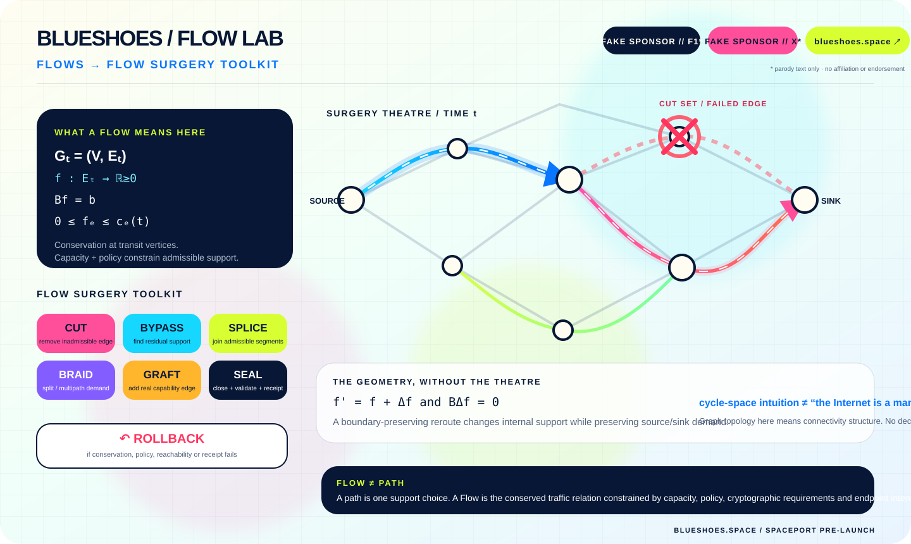

<div align="center">

# 👟 BLUESHOES

### **POST-OPENWRT · POST-VPN · POST-DPI · POST-QUANTUM**

# **THE INTERNET IS FREE. AGAIN!**

### **An AI-driven routing brick for cheap routers.**

**OpenBSD-first · RAM-only · self-healing · self-evolving · Rheknel-governed**

## **FLOWS → FLOW SURGERY TOOLKIT**

*The router that refuses to trust the network, the cloud, the model — or itself.*

**FAKE SPONSOR // F1\*** · **FAKE SPONSOR // X\*** · **SPACEPORT // [blueshoes.space](https://blueshoes.space) · PRE-LAUNCH**

<sub>\* parody text labels only — no affiliation, sponsorship, endorsement, or copied logos.</sub>

[Flows](#-flows-not-routes) · [Flow Surgery](#-flow-surgery-toolkit) · [Mutation](#-asynchronous-topological-mutation) · [mbsd](#-mbsd-the-empty-machine) · [Rheknel](#-rheknel-local-truth-or-it-didnt-happen) · [PQ](#-post-quantum-by-architecture-not-by-sticker) · [Space](#-blueshoesspace-the-spaceport) · [Reality](#-we-dont-fake-receipts)

</div>

<p align="center">
  
</p>

> **This is the target architecture Blueshoes is building toward.** The README is intentionally ambitious. The [reality section](#-we-dont-fake-receipts) separates architecture from what this repository has actually proved.

---

## ⚡ The proposition

The old router stack accumulated too many sovereigns.

A firmware vendor owns the box. DNS owns the name. BGP owns the path. A VPN vendor rents you one exit. A cloud dashboard remembers the configuration. Classical-only public-key exchange assumes *harvest now, decrypt later* is somebody else's problem. And an AI agent can always produce an extremely confident sentence about a thing that never executed.

**Blueshoes is the refusal.**

It is being designed as a **post-OpenWrt, post-VPN, post-DPI, post-quantum network operating system** for inexpensive commodity routers: a small OpenBSD-first machine that lives in RAM, measures its local network, forms bounded hypotheses, proposes topology changes, submits them to a deterministic local authority, validates the result, heals backward when wrong, and forgets operational exhaust when power disappears.

The key abstraction is not **the tunnel**.

It is not even **the route**.

It is the **Flow**.

---

# 🌈 **FLOWS, NOT ROUTES**

A route is one geometrical realization of connectivity.

A **Flow** is the traffic relation we intend to preserve while the realization is allowed to change.

For the scientific picture, model the locally known network at time `t` as a directed multigraph:

$$
G_t = (V, E_t)
$$

with time-dependent capacities `c_e(t)`, costs, policy labels, cryptographic requirements, reachability evidence and failure state attached to edges.

A single-commodity feasible flow can be written as:

$$
f : E_t \to \mathbb{R}_{\ge 0}
$$

subject to

$$
Bf = b, \qquad 0 \le f_e \le c_e(t)
$$

where `B` is the oriented incidence matrix and `b` contains the source/sink demand boundary. At ordinary transit vertices, net flow is conserved.

That gives Blueshoes a clean distinction:

- **path** = one ordered support through the graph;
- **Flow** = the conserved relation carried by one or more admissible supports;
- **policy** = which supports are allowed;
- **capacity** = how much traffic an edge can carry;
- **receipt** = evidence that the chosen support actually satisfied the declared constraints.

For multiple simultaneous traffic classes, the useful picture is a multi-commodity flow: each commodity keeps its own conservation equation while all commodities share edge capacity,

$$
\sum_k f^{(k)}_e \le c_e(t).
$$

That is much closer to reality than pretending “the Internet” is one line drawn from a laptop to a VPN server.

<p align="center">
  
</p>

### Topology, without fake mysticism

When Blueshoes says **topology**, it means the **connectivity structure of the graph / capability graph**: which vertices can be joined through currently admissible edges and which cut-sets destroy that reachability.

It does **not** mean the physical Internet has secretly become a smooth manifold because the README discovered Greek letters.

Graph geometry is already strange enough.

---

# ✂️ **FLOW SURGERY TOOLKIT**

A **Flow Surgery** operation changes the internal support of a Flow while trying to preserve its external intent and constitutional boundary.

If the source/sink boundary stays unchanged, an idealized reroute can be written

$$
f' = f + \Delta f
$$

with

$$
B\Delta f = 0.
$$

That equation is the clean algebraic reason rerouting can alter internal edges without changing what enters and leaves the network boundary. The allowed `Δf` lives in the graph's cycle-space intuition — useful mathematics, not a claim that packet networks are topological manifolds.

When an edge fails or becomes inadmissible, the problem becomes: find a new feasible `f'` on the residual admissible graph while preserving policy, capacity, endpoint intent and cryptographic requirements.

### The toolkit vocabulary

| Tool | Graph meaning | Blueshoes meaning |
|---|---|---|
| **CUT** | remove an edge or cut-set from the admissible graph | declare a failed, forbidden or policy-invalid capability unusable |
| **BYPASS** | find feasible support in the residual graph | route the same Flow around the damaged region |
| **SPLICE** | concatenate compatible path segments | join locally admissible segments through a real gateway / capability boundary |
| **BRAID** | distribute a commodity across multiple supports | bounded multipath or risk-diverse carriage under shared capacity constraints |
| **GRAFT** | introduce a new edge into the capability graph | add a **real** reachable overlay, peer, tunnel, SCION gateway, mesh adjacency, etc. |
| **SEAL** | freeze candidate support after validation | validate reachability + invariants, then issue a receipt |
| **ROLLBACK** | restore the previous admitted state | reverse surgery when validation or policy fails |

### One non-negotiable rule

**GRAFT never means invent connectivity.**

An overlay edge exists only if there is an actual reachable substrate beneath it. A mesh needs peers and a medium. SCION needs reachable SCION infrastructure or gateways. A tunnel needs a peer. Physics remains annoyingly constitutional.

### Cut-sets are where the drama lives

A cut partitions the graph into two vertex sets. If the total admissible capacity across that cut collapses below the Flow demand, no amount of AI optimism makes the Flow feasible.

That is why the Flow Surgery toolkit is allowed to return:

> **REJECT — no admissible support exists.**

A beautiful failure is better than invented connectivity.

---

## 🌊 Asynchronous topological mutation

Blueshoes does not require every dimension of a connection to move together.

The target system can mutate across **four independent dimensions**:

| Dimension | What may change | Candidate capability | Guardrail |
|---|---|---|---|
| **PATH** | support carrying the Flow | IP routing, multipath, operator tunnels, SCION where available | no claim that SCION unilaterally bypasses arbitrary BGP infrastructure |
| **NAME** | service-resolution relation | encrypted DNS mechanisms, local mappings, GNS where appropriate | decentralized naming is not literally unblockable |
| **MEDIUM** | underlying adjacency | Ethernet, Wi-Fi, local peer links, Yggdrasil-like overlay / mesh | software cannot conjure a missing radio or exit |
| **CRYPTOGRAPHIC EPOCH** | session key-establishment capability | classical + standardized PQ/T hybrid mechanisms | “post-quantum” requires actual negotiated evidence |

A failed path does not require renaming the service. A poisoned naming path does not require changing the radio. A cryptographic epoch change does not require rebuilding the physical topology.

### **The smallest sufficient surgery wins.**

---

## 🧱 mbsd: the empty machine

The end-state is a **routing brick**, not a general-purpose desktop hiding inside a plastic router.

`mbsd` is the project name for the intended minimal trusted system: **OpenBSD-first in security/networking semantics, whole-OS RAM-only as the target operating model, and aggressively stripped of unnecessary durable state and interactive surface**.

```text
                verified seed
                    │
                    ▼
        ┌─────────────────────────┐
        │       mbsd / RAM        │
        │                         │
        │   Flows / observations  │
        │   capability graph      │
        │   tribunal models       │
        │   Flow Surgery plans    │
        │   RHEKNEL authority     │
        │   rollback material     │
        └─────────────────────────┘
                    │
               power removed
                    │
                    ▼
          operational amnesia
```

**RAM-only does not mean “nothing can ever persist.”** Persistence is an exception that must be explicit, bounded and justified. Keys, bootstrap material or signed upgrades may need durable storage; browsing exhaust, model chatter and accidental telemetry do not automatically earn that privilege.

And a terminology guardrail: stock OpenBSD is not being renamed a microkernel. Any future microkernel-style TCB or hardware-isolation claim for `mbsd` must be specified and demonstrated separately.

---

## 🗿 omnia-playbook: memory of the normal

`omnia-playbook` is intended to become a **versioned reference corpus of protocol invariants, standards-compliant behavior, historical local observations and admissible envelopes**.

Not an oracle. Not “absolute truth.” Not a packet-for-packet impersonation database.

Its useful question is:

> **How far did the current local network move from the set of behaviors we were prepared to accept?**

That reference can feed topology, timing, failure-pattern, transport-negotiation and distributional metrics without giving a model application plaintext.

A baseline is evidence. It is never sovereignty.

---

## 🧠 Three blind mathematicians

The target local Tribunal separates sensing from authority.

Three independent model families can inspect different projections of the same event:

1. **Topology observer** — adjacency, cut-sets, path availability, reachability discontinuities.
2. **Timing / spectral observer** — delay distributions, bursts, retransmission structure and temporal anomalies.
3. **Entropy / distribution observer** — changes in the statistical shape of locally observable metadata.

Candidate statistics may include Wasserstein distances or other distributional metrics. But **a distance metric is not a censor detector**. Congestion, radio interference, overloaded middleboxes and ordinary route changes can produce similar signals.

The models produce bounded evidence and hypotheses.

They do not promote their own answer.

---

## 🧿 Rheknel: local truth or it didn't happen

Between probabilistic inference and **Flow Surgery** sits **Rheknel**: the intended deterministic local arbiter.

```text
observe Flow / graph state
        │
        ▼
independent model outputs
        │
        ▼
proposed surgery / capability graph
        │
        ▼
┌──────────────────────────────┐
│           RHEKNEL            │
│ provenance?                  │
│ flow boundary preserved?     │
│ capability admissible?       │
│ policy / crypto satisfied?   │
│ rollback material exists?    │
└──────────────────────────────┘
     │ allow            │ reject
     ▼                  └───────▶ observe again
 snapshot
     │
     ▼
 bounded surgery
     │
     ▼
 validate
  │       │
 pass    fail
  │       │
  ▼       ▼
 SEAL   ROLLBACK
  │
 receipt
```

No sub-millisecond or `O(1)` performance claim belongs here until a defined implementation and hardware benchmark produces a receipt.

### **AI proposes. Rheknel arbitrates. The machine proves.**

---

## 🥷 Post-DPI does not mean “perfectly invisible”

DPI is treated as an **active, adaptive network condition**, not one frozen signature to defeat forever.

Blueshoes aims to remove single points of classification and failure through encrypted naming where supported, protocol/path diversity, modern standards-based transports, bounded Flow Surgery, local anomaly measurement and a strategy layer that may evolve while the **authority layer remains invariant**.

**Post-DPI** therefore means architectural non-ossification: one hostname, route, tunnel endpoint, transport fingerprint or provider must not become the permanent center of the system.

It is not a claim of perfect invisibility or immunity to global traffic analysis.

---

## 🔐 Post-quantum by architecture, not by sticker

The post-quantum target is **crypto agility plus standardized hybrid key establishment**.

For TLS 1.3, [RFC 10024](https://www.rfc-editor.org/rfc/rfc10024.html) defines PQ/traditional hybrid groups including **X25519MLKEM768**. ML-KEM itself is standardized by [NIST FIPS 203](https://csrc.nist.gov/pubs/fips/203/final). For SSH, [RFC 10042](https://www.rfc-editor.org/rfc/rfc10042.html) defines ML-KEM-based PQ/traditional hybrid key exchange methods.

Target rules:

- prefer hybrid migration rather than a reckless one-shot replacement;
- keep cryptographic selection behind a typed capability boundary;
- make negotiated algorithm/version observable to the validator;
- never silently downgrade a policy requiring PQ/T protection;
- audit identity/update signing separately from transport key establishment;
- treat **PQ protected** as a receipt-bearing session property, not a decorative adjective.

**The repository does not yet contain a verified Blueshoes PQ transport implementation or target-router PQ benchmark.**

---

## 🧬 The polymorphic substrate

**SCION** may become a path capability where suitable infrastructure/gateways exist.

**GNS / RFC 9498** may become an alternate naming capability for participating namespaces.

**Yggdrasil** may become one experimental overlay/mesh capability where peers and an actual medium exist.

A WireGuard-like or MASQUE-like tunnel may still be the right tool for one Flow.

Fine.

The post-VPN claim is simply:

> **the tunnel is no longer the operating system, the identity, the policy engine, the route oracle and the business model all at once.**

---

## 🫥 Hide your traffic from yourself

Privacy starts with refusing to manufacture evidence you never needed.

The target design prefers ephemeral operational state in RAM, short diagnostic retention, aggregate/model inputs rather than payloads, no mandatory browsing history, no mandatory remote routing account, explicit durable-state allowlists, secrets outside ordinary logs/model context, and reboot as a meaningful privacy boundary.

### **Collect less. Know less. Leak less. Forget on purpose.**

---

# 🪐 blueshoes.space: the spaceport

A project called Blueshoes was eventually going to acquire unnecessary astronomy.

So the repository now contains a tiny static **Flow Surgery Spaceport** prepared for:

### **[blueshoes.space](https://blueshoes.space)**

```text
blueshoes.space
     │
     ├── FLOW LAB
     ├── FLOW SURGERY
     ├── break the little internet
     └── back to the actual GitHub evidence
```

The repo includes:

- [`docs/CNAME`](docs/CNAME) → `blueshoes.space`
- [`docs/index.html`](docs/index.html) → the bright pre-launch spaceport
- [`docs/readme/playground.html`](docs/readme/playground.html) → the offline synthetic topology toy

**Important boring fact:** GitHub Pages is not currently asserted as active for this repository, and DNS configuration lives outside the repo. The wiring is prepared; the launch switch still needs Pages + DNS.

---

## 🎛️ Break the little internet

The offline synthetic topology playground lets you break links, change a toy policy ceiling, opt an imaginary tunnel in/out, isolate every path and export a deliberately labeled synthetic receipt:

### [`docs/readme/playground.html`](docs/readme/playground.html)

No admissible path means **REJECT**. It never invents connectivity to make the demo successful.

The playground is not the production Flow solver, not Rheknel, not live telemetry, not a model call and not evidence of censorship resistance.

---

## 🏁 The totally legitimate sponsor wall

<div align="center">

### **FAKE SPONSOR // F1\*** &nbsp;&nbsp;&nbsp; **FAKE SPONSOR // X\***

**REAL SPONSORS // Kirchhoff · Ford–Fulkerson · Max-Flow/Min-Cut · boring conservation laws · physics**

<sub>\* Parody text only. Blueshoes is not affiliated with, sponsored by, endorsed by, or pretending to be Formula 1 / Formula One or X. No official logos are used. Please send packet traces instead of lawyers.</sub>

</div>

---

## 🚧 We don't fake receipts

This README describes the **destination**. The repository is not yet the destination.

### What exists in the inspected tree

The current repository contains a Rust `bs-edge-agent`, network probes, structured journaling, capability-graph planning, rollback/watchdog machinery, semantic/provenance checks and an explicit `dangerous_execution` feature gate.

The inspected source remains substantially **FreeBSD-oriented**. OpenBSD-first `mbsd` is the intended direction; it is not established by changing nouns in Markdown.

### Architecture target — not yet a verified implementation claim

- bootable `mbsd` on target cheap-router hardware;
- whole-system RAM-only operation with a defined durable-state boundary;
- microkernel / hardware-isolation claims;
- production Rheknel enforcement;
- on-device independent Tribunal;
- production **Flows** abstraction and **Flow Surgery toolkit** operations;
- automatic strategy synthesis/promotion under real fault injection;
- SCION / GNS / Yggdrasil integration;
- negotiated PQ/T transport enforcement and target-router ML-KEM benchmarks;
- reliable attribution of DPI from timing/topological signals;
- universal censorship resistance, obfuscation or anonymity.

**A future commit may move an item above this line only with a reproducible receipt.**

See [`docs/readme/SOURCE_NOTES.md`](docs/readme/SOURCE_NOTES.md) for the presentation evidence map.

---

## 🗺️ Road to the blue brick

### Foundation
- [x] Rust edge-agent skeleton
- [x] read-only network telemetry surfaces
- [x] deterministic plan / structured-journal surfaces
- [x] explicit dangerous-execution compile gate
- [x] rollback/watchdog architecture present in the tree
- [x] provenance / semantic validation surfaces

### Flows / Flow Surgery
- [ ] canonical `Flow` contract and identity model
- [ ] capacity/policy/crypto constraint schema
- [ ] residual-graph + cut-set evidence model
- [ ] typed `CUT / BYPASS / SPLICE / BRAID / GRAFT / SEAL / ROLLBACK` capability vocabulary
- [ ] multi-commodity admission experiments
- [ ] receipt schema proving pre/post-surgery invariants

### mbsd / local cognition
- [ ] exact `mbsd` kernel/TCB architecture
- [ ] OpenBSD-first boot image + RAM-only target
- [ ] versioned `omnia-playbook`
- [ ] independent topology / timing / entropy observers
- [ ] Rheknel as enforced local promotion gate
- [ ] bounded AI strategy synthesis
- [ ] adversarial fault-injection corpus

### Post-DPI / post-quantum
- [ ] modern encrypted-transport capability adapters
- [ ] SCION / GNS / Yggdrasil experiments
- [ ] crypto-agility policy schema
- [ ] X25519MLKEM768 TLS 1.3 experiment
- [ ] PQ/T SSH/admin-path experiment
- [ ] downgrade-policy receipts
- [ ] ML-KEM latency / RAM / code-size measurements on target hardware

---

## 🤝 Build the thing that survives the sentence

Blueshoes needs people who enjoy breaking assumptions in:

**graph theory · network flow · max-flow/min-cut · OpenBSD · embedded boot · MediaTek · pf · Rust · SCION · GNUnet/GNS · Yggdrasil · QUIC · MASQUE · ECH · ML-KEM · TLS 1.3 · adversarial measurement · reproducible systems · tiny ugly routers · formal-ish invariants · red-team engineering**

Start with [`SECURITY.md`](SECURITY.md), the RFC corpus, and the [source notes](docs/readme/SOURCE_NOTES.md).

If your contribution makes the README less exciting but the machine more truthful, it is probably a good contribution.

---

<div align="center">

# 👟 BLUESHOES

## **FLOWS SURVIVE. PATHS ARE NEGOTIABLE.**

### **CUT THE FAILURE. SPLICE THE GRAPH. BRAID THE FLOW. PROVE THE RESULT.**

**Own the brick. Mutate the topology. Distrust the route. Keep the internet.**

### *The internet is free. Again!* 🌈🌊✂️

[blueshoes.space](https://blueshoes.space) · [MIT](LICENSE) · [Security](SECURITY.md) · [RFCs](docs/rfcs/) · [Flow Playground](docs/readme/playground.html)

</div>
