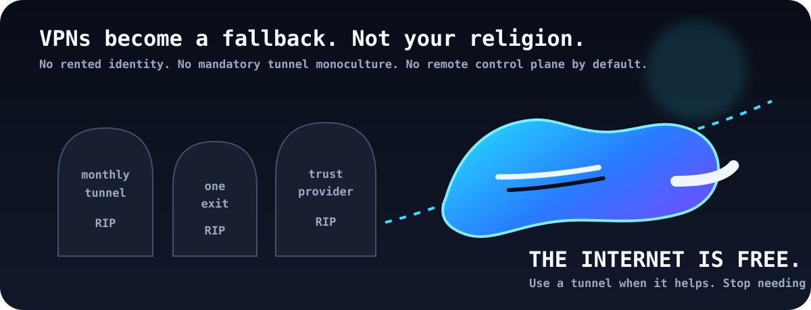
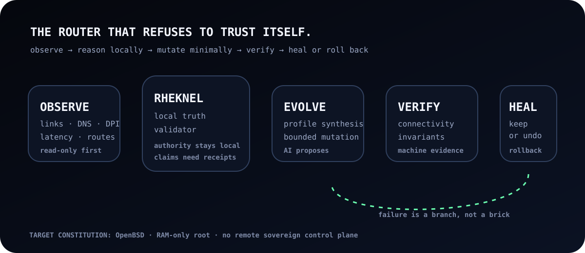
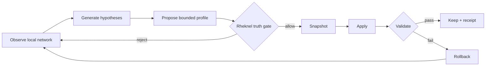

<div align="center">

# 👟 BLUESHOES

### **The router that refuses to trust itself.**

**AI-driven · self-healing · self-evolving · OpenBSD-first · RAM-only**

> ### **THE INTERNET IS FREE. AGAIN.**
> Your network should not require a rented identity, a permanent tunnel subscription, or a remote sovereign control plane.

[Architecture](#-what-blueshoes-is) · [Rheknel](#-rheknel-local-truth-inside-the-core) · [Privacy](#-forgetful-by-design) · [Reality check](#-reality-check) · [Build](#-current-developer-surface)

</div>

<p align="center">
  
</p>

---

## 🧠 What Blueshoes is

Blueshoes is an experimental **cheap-router operating system** designed to become an **OpenWrt replacement**, not another app that installs a tunnel on top of somebody else’s firmware.

The intended machine is brutally simple:

```text
                     hostile / broken / filtered network
                                  │
                                  ▼
                    ┌─────────────────────────┐
                    │       BLUESHOES         │
                    │       OpenBSD core      │
                    │                         │
 observe ──────────▶│  AI proposes changes   │
                    │         │               │
                    │         ▼               │
                    │     RHEKNEL             │
                    │   local truth gate      │
                    │         │               │
                    │         ▼               │
                    │ bounded route mutation  │
                    │         │               │
                    │         ▼               │
                    │ verify → keep / rollback│
                    └─────────────────────────┘
                                  │
                                  ▼
                              the internet
```

It watches the network, forms a bounded hypothesis about what changed, proposes the smallest useful routing/profile change, checks that proposal against local invariants, validates connectivity, and either keeps the new state or **heals backward**.

Not “AI has root.”

**AI proposes. The machine proves.**

<p align="center">
  
</p>

---

## ⚡ The end-state

Blueshoes is being shaped around six architectural properties:

| Property | Intended meaning |
|---|---|
| **OpenBSD-first** | The BSD core is the constitutional authority. OpenWrt is a hardware/bootstrap compatibility layer during transition, not the long-term sovereign runtime. |
| **RAM-only OS** | Operational state lives in volatile memory wherever practical. Reboot means amnesia. Persistent state must be explicit, minimal and justified. |
| **Self-healing** | Every meaningful network mutation is treated as a reversible transaction with validation and rollback. |
| **Self-evolving** | The system may synthesize or refine bounded network strategies from local evidence, but promotion requires deterministic gates and receipts. |
| **AI-driven, not AI-sovereign** | Models can observe, rank hypotheses and propose policies. They do not get an unbounded shell or the authority to redefine invariants. |
| **Local truth** | The final authority is local evidence plus Rheknel-enforced invariants, not a cloud dashboard, VPN vendor or model assertion. |

The desired result is firmware that can **adapt faster than a static censorship rule-set** without becoming a probabilistic rootkit with good branding.

---

## 🧿 Rheknel: local truth inside the core

**Rheknel** is the intended local truth validator for the Blueshoes control plane.

Its job is deliberately less glamorous than the AI layer—and more important:

1. **Receive a proposed transformation.**
2. **Require provenance and machine-observable evidence.**
3. **Check constitutional invariants.**
4. **Reject semantic inflation** such as “verified”, “safe”, or “healed” without a receipt.
5. **Permit only a bounded capability graph.**
6. **Require post-change validation.**
7. **Force rollback when the new state cannot prove itself.**

The local router should be allowed to distrust:

- the network,
- the model,
- the cloud,
- a peer,
- a stale configuration,
- **and its own last decision**.

That is the point.

---

## 🫥 Forgetful by design

“Hide your traffic from yourself” is not magic anonymity. It is an engineering constraint: **collect less, retain less, expose less**.

The target design minimizes durable local exhaust:

- ephemeral runtime state in RAM;
- short-lived diagnostics instead of permanent browsing histories;
- explicit retention boundaries for telemetry;
- no mandatory vendor account to route packets;
- no mandatory commercial VPN exit;
- no cloud control plane as runtime source of truth;
- secrets kept outside ordinary logs and model context;
- reboot as a meaningful privacy boundary.

Against an ISP, filtering middlebox, hostile Wi-Fi operator, or state-level censor, Blueshoes aims to make traffic classification and route suppression **harder and less stable** through protocol diversity, encrypted naming, modern transports and adaptive routing.

It does **not** claim perfect anonymity, invisibility, or immunity to global traffic analysis. Those are different problems.

---

## 🪦 So… death to VPNs?

**Death to VPN dependency.** Not death to cryptography and not a claim that tunnels are useless.

A VPN is one routing primitive. Blueshoes wants it demoted from *religion* to *tool*.

<details>
<summary><b>Click to choose your routing theology</b> 🕳️</summary>

<br />

| Situation | Conventional answer | Blueshoes answer |
|---|---|---|
| DNS interference | “Turn on the VPN.” | Try encrypted/oblivious naming first; verify what actually failed. |
| One route is black-holed | “Move the whole device into a tunnel.” | Route around the failure with the smallest bounded change. |
| TLS metadata is filtered | “Buy a stealthier VPN.” | Prefer standardized mechanisms such as ECH/QUIC/MASQUE where available; preserve protocol integrity. |
| Tunnel endpoint is blocked | “Find another provider.” | Treat tunnels as interchangeable operator-selected capabilities, not the architecture itself. |
| New profile breaks connectivity | “SSH in and pray.” | Watchdog + validation window + rollback. |
| AI suggests something clever | “YOLO.” | Rheknel asks for receipts. |

</details>

Commercial tunnels can remain optional escape hatches. Blueshoes should still be useful when **zero VPN accounts exist**.

---

## 🧬 Self-evolution without self-coronation

The interesting part is not a router that changes itself. Routers have been doing that badly for decades.

The interesting part is a router that can **propose new behavior while being structurally unable to promote that behavior merely because an AI said so**.



A future strategy can be novel. The **authority path cannot be novel**.

---

## 🧱 Firmware, not a SaaS costume

Target deployment: inexpensive commodity routers, beginning with the **GL.iNet GL-MT3000 / MediaTek MT7981B class**.

Design preferences:

- small auditable native components;
- BSD network primitives and firewall semantics;
- deterministic capability boundaries;
- watchdog-survivable updates;
- no opaque agent framework in the packet path;
- no LLM-generated raw shell as a control protocol;
- local-first operation;
- optional replication or telemetry that can never become runtime sovereignty.

If the internet disappears because the optimizer got creative, the optimizer loses.

---

## 🚧 Reality check

This README describes the **project direction** and the architecture Blueshoes is converging toward. It deliberately does **not** pretend the end-state is already complete.

### Present repository evidence

The current repository contains a Rust `bs-edge-agent`, local probes, structured journaling, capability-graph planning, rollback/watchdog machinery, semantic/provenance checks, and an explicit `dangerous_execution` feature gate. The current `ApplyConfirmed` path still instantiates the **dry-run executor**, so this repository snapshot should not be marketed as a finished autonomous router OS.

The codebase and earlier RFCs also contain **FreeBSD-oriented implementation paths**. The intended constitution is now **OpenBSD-first**; migration and target-hardware proof must be demonstrated rather than inferred from README prose.

### Not yet a verified claim

- full OpenBSD migration;
- whole-OS RAM-only boot on target hardware;
- autonomous self-evolution in production;
- proven state-level censorship resistance;
- universal traffic obfuscation;
- perfect anonymity;
- Rheknel enforcement inside a production BSD kernel path.

If a future commit proves one of those, move it above the line with a reproducible receipt. Until then, it stays here.

---

## 🧪 Current developer surface

The existing agent exposes useful inspection and planning commands:

```bash
# local system / network observations
bs-edge-agent status
bs-edge-agent netcheck
bs-edge-agent doctor
bs-edge-agent env

# inspect available profiles
bs-edge-agent profiles

# generate a bounded plan
bs-edge-agent plan USER_TUNNEL --out /tmp/plan.json

# deterministic dry-run canary by default
bs-edge-agent canary

# inspect journal
bs-edge-agent journal --tail 20

# semantic / provenance surfaces
bs-edge-agent substrate-verify
bs-edge-agent substrate-repro-audit
bs-edge-agent check-compliance
```

> **Default stance:** observe and plan. Mutation must remain explicit, bounded, recoverable, and independently verifiable.

---

## 🛡️ Non-negotiables

```text
NO MITM BY DEFAULT.
NO CLOUD SOVEREIGNTY.
NO AI ROOT SHELL.
NO IRREVERSIBLE ROUTE MUTATION.
NO “VERIFIED” WITHOUT EVIDENCE.
NO VPN VENDOR AS A REQUIRED TRUST ANCHOR.
NO BRICKING THE ROUTER TO WIN AN ARGUMENT WITH THE NETWORK.
```

Human authority remains part of the current high-risk execution model. Autonomous capability may expand only when the local enforcement layer can make the same safety property **less dependent on trust**, not more.

---

## 🗺️ Road to the blue brick

- [x] Rust edge-agent skeleton
- [x] read-only network telemetry
- [x] deterministic plans / structured journal
- [x] explicit dangerous-execution compile gate
- [x] rollback + watchdog architecture under development
- [x] provenance / semantic validation surfaces
- [ ] OpenBSD-first bootable target image
- [ ] RAM-only root on GL-MT3000-class hardware
- [ ] packet-path / firewall adapters proven on target hardware
- [ ] Rheknel as enforced local promotion gate
- [ ] bounded AI strategy synthesis
- [ ] adversarial network test corpus
- [ ] self-healing route mutation with reproducible hardware receipts
- [ ] privacy-preserving multi-node topology intelligence

---

## 🤝 Contributing

Useful contributors are not limited to Rust programmers.

Blueshoes needs people who enjoy breaking assumptions in:

**OpenBSD · routing · pf · embedded boot · MediaTek · Rust · network measurement · QUIC · MASQUE · ECH · encrypted DNS · reproducible systems · adversarial testing · formal-ish invariants · tiny ugly routers**

Start with the RFC corpus and [`SECURITY.md`](SECURITY.md). For implementation work, respect the repository’s capability boundaries and tribunal/receipt requirements.

If your contribution makes the README less exciting but the machine more truthful, it is probably a good contribution.

---

<div align="center">

## 👟 **BLUESHOES**

### **Own the router. Distrust the route. Keep the internet.**

*No subscription required to believe in packets.*

[MIT License](LICENSE) · [Security](SECURITY.md) · [RFCs](docs/rfcs/)

</div>
